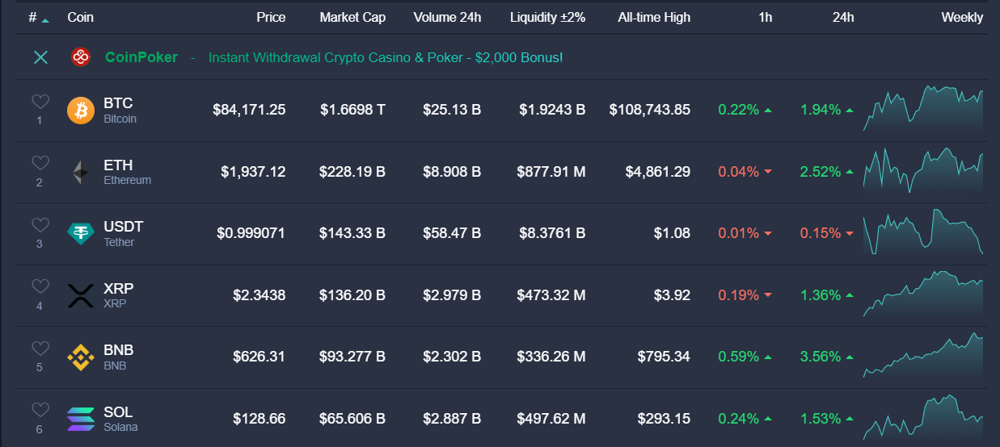
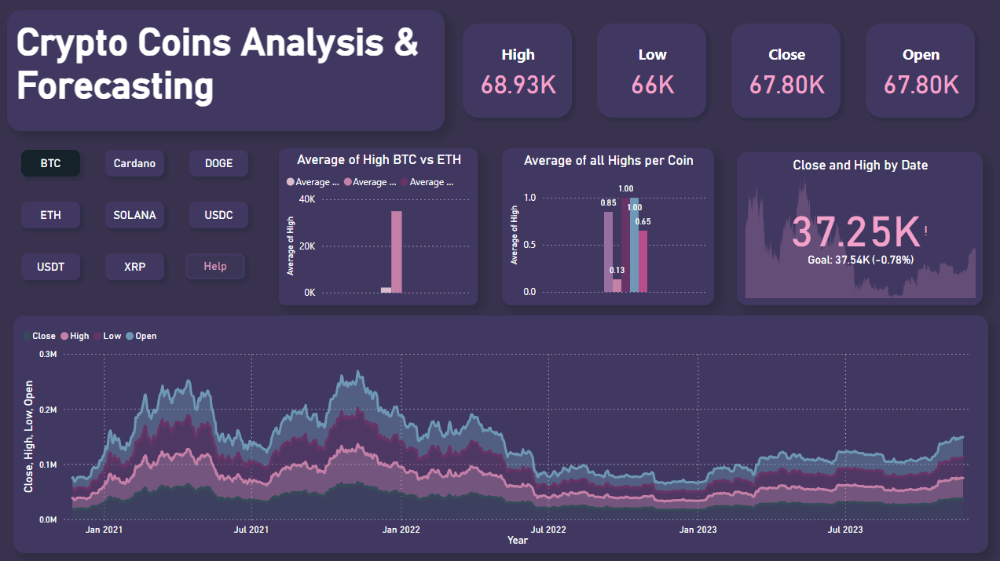
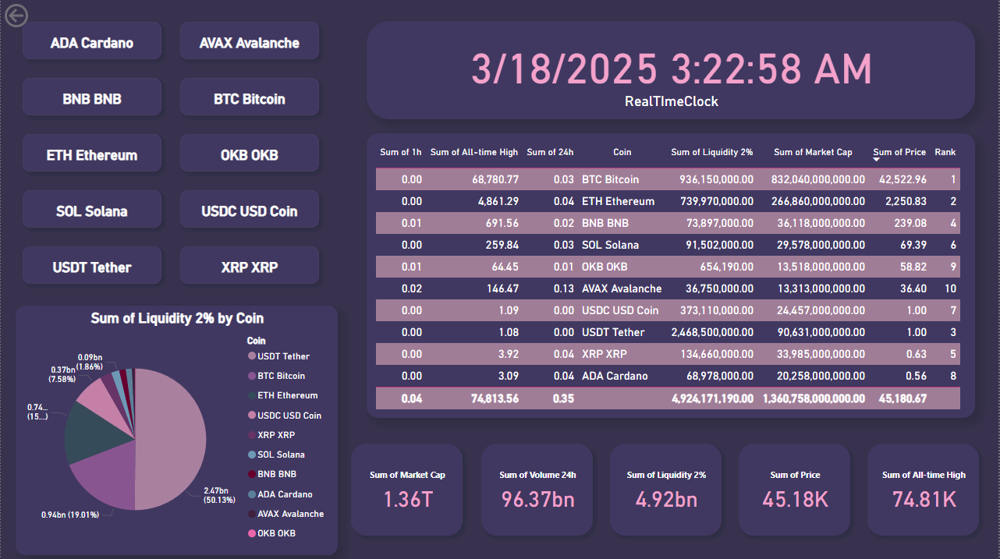
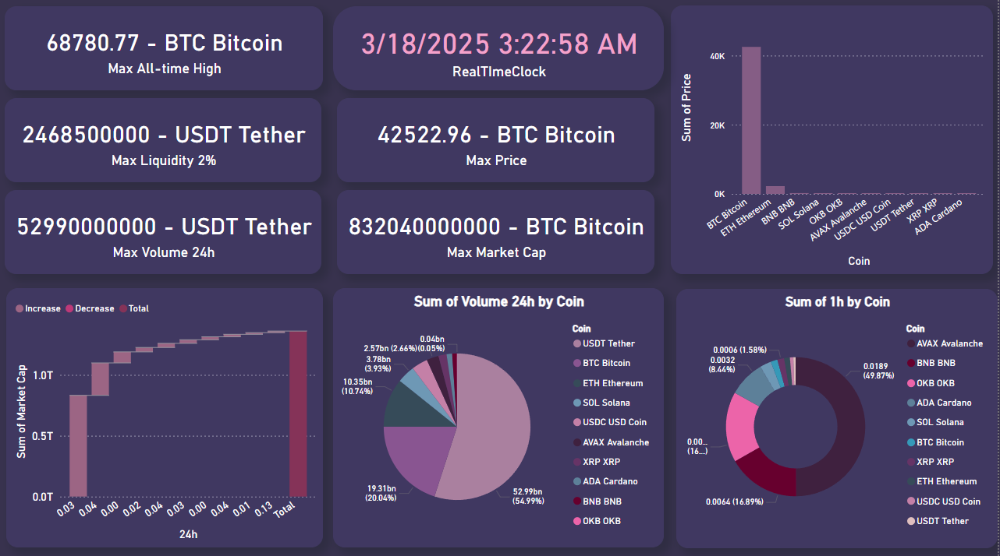

# Data Visualization Projects Repository

Welcome to the **Data Visualization Projects Repository**

This repository is dedicated to showcasing various data visualization projects that leverage modern tools and technologies to present complex datasets in an interactive and insightful manner. Each project focuses on a unique domain, using techniques such as real-time data integration, statistical analysis, and machine learning-driven insights to provide meaningful visual representations.

This repository will continue to grow as more projects are added. Stay tuned for updates! 🎨📊

---

## 📌 Projects

### 1️⃣ Crypto Coins Analysis & Forecasting

#### 🔹 Abstract

Cryptocurrency markets are highly dynamic and require data-driven insights for effective decision-making. The **Crypto Coins Analysis & Forecasting** project provides a comprehensive solution for analyzing both **historical and real-time cryptocurrency data**. By leveraging **web scraping, database integration, data analysis, and machine learning techniques**, this project empowers users with actionable insights into crypto market trends and predictions.

#### 🔹 Data Sources and Integration

This project consists of two key components:

1. **Real-time Data**: Collected from [LiveCoinWatch](https://www.livecoinwatch.com/) using Power BI’s **Get Data** feature. The scraped data undergoes multiple **ETL transformations** to ensure a clean and structured format.

   🔹 Sample of real-time data representation from the source:
   

2. **Historical Data**: We gathered historical price data spanning **three years** for **six major cryptocurrencies**. This data was stored in a **SQLite3 database**, which was integrated with Power BI using **ODBC drivers**. The dataset can be refreshed manually to reflect the latest available market information.

#### 🔹 Visualizations

To effectively present insights, we utilized **Power BI** visualizations, including:

- **Pie Charts** 📊
- **Area Charts** 📈
- **Bar Charts** 📉
- **KPIs & Cards** 💡

The dashboards are designed with **Figma templates** for an enhanced user experience. Below are the key Power BI dashboards:

🔹 **Info Page** - Overview of the cryptocurrency market:

🔹 **Real-Time Dashboard** - Displays live data trends:

🔹 **Plots & Analysis** - Deep dive into historical trends:

#### 🔹 DAX Measures & Advanced Analytics

To derive meaningful insights, we employed **DAX measures**, such as:

- `SUM`, `FILTER`, `MAX`, `SWITCH`, and `NOW` functions to calculate real-time statistics.
- **Drill-through features** to navigate between historical and real-time data seamlessly.

#### 🔹 Conclusion

The **Crypto Coins Analysis & Forecasting** project successfully delivers a **powerful tool** for analyzing cryptocurrency trends, helping users make **informed investment decisions**. Whether you're an amateur investor or someone exploring the crypto market, this tool provides valuable insights into **market valuation, trends, and risk factors**.

---

### Recently Added: Meteorite Analysis and Visualization

### 📌 More projects coming soon!

This repository will continue to expand with more **data visualization projects** across different domains. Stay tuned! 🚀
